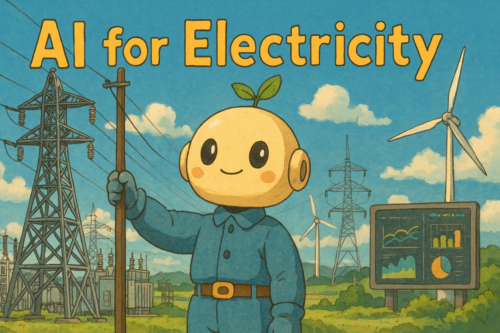

# Awesome-AI-for-Electricity [](https://github.com/sindresorhus/awesome)

<p align="center">
  <a href="">
    
  </a>
</p>

A curated list of awesome papers, tools, datasets, and resources at the intersection of Artificial Intelligence (AI) and the Electric Power industry. This repository aims to provide researchers, engineers, and enthusiasts with a comprehensive collection of high-quality resources for applying AI—including machine learning, deep learning, and large language models (LLMs)—to electric power systems.

🎯 Focus areas include Smart Grids, Load Forecasting, Power System Optimization, Electricity Markets, Digital Twins, and more.

⚡️ Contributions are welcome! Feel free to open issues or submit pull requests to add new content.

📩 If you have related papers, technical reports, or repositories that are not yet included, feel free to [***email me***]((rl4electric.ai@hotmail.com)) and I’ll be happy to add them. You can cite this repository as follows:

```
@misc{AwesomeAI4Electricity, 
      author = {AI4Electricity Group}, 
      title = {Awesome AI for Electricity}, 
      year = {2025}, 
      url = {https://github.com/AI4Electricity/Awesome-AI-for-Electricity}
}
```

📘 本项目还提供了[[中文版本](./chinese.md)]，方便中文用户阅读与引用。


## 📦 Contents

- [Awesome-AI-for-Electricity ](#awesome-ai-for-electricity-)
  - [📦 Contents](#-contents)
  - [Surveys](#surveys)
  - [LLM Tools](#llm-tools)
  - [Papers](#papers)
  - [Websites](#websites)
  - [Datasets](#datasets)
  - [Others](#others)

## Surveys

<details open>
<summary><h3 style="margin: 0; display: inline-block">Surveys</h3></summary>

* **An Overview of Artificial Intelligence Applications for Power Electronics**  [[paper](https://ieeexplore.ieee.org/document/9200511)]
  * Zhao, Shuai and Blaabjerg, Frede and Wang, Huai, ***IEEE Transactions on Power Electronics***, *2020*

* **A Review and Evaluation of the State-of-the-Art in PV Solar Power Forecasting: Techniques and Optimization**  [[paper](https://www.sciencedirect.com/science/article/abs/pii/S1364032120300885)]
  * R. Ahmed, V. Sreeram, Y. Mishra, M.D. Arif, ***Renewable and Sustainable Energy Reviews***, 2020

* **A Survey of Graph Neural Networks for Electronic Design Automation**  [[paper](https://ieeexplore.ieee.org/abstract/document/9531070)]
  * Lopera, Daniela Sanchez and Servadei, Lorenzo and Kiprit, Gamze Naz and Hazra, Souvik and Wille, Robert and Ecker, Wolfgang, ***MLCAD***, 2021

* **A Survey on Deep Learning Methods for Power Load and Renewable Energy Forecasting in Smart Microgrids** [[paper](https://www.sciencedirect.com/science/article/pii/S1364032121002847)]
  * Aslam, Sheraz and Herodotou, Herodotos and Mohsin, Syed Muhammad and Javaid, Nadeem and Ashraf, Nouman and Aslam, Shahzad, ***Renewable and Sustainable Energy Reviews***, 2021

* **Review of Deterministic and Probabilistic Wind Power Forecasting: Models, Methods, and Future Research**  [[paper](https://www.mdpi.com/2673-4826/2/1/2)]
  * Bazionis, Ioannis K., and Pavlos S. Georgilakis, ***Electricity***, 2021

* **Data-driven Probabilistic Machine Learning in Sustainable Smart Energy/Smart Energy Systems: Key Developments, Challenges, and Future Research Opportunities in the Context of Smart Grid Paradigm**  [[paper](https://www.sciencedirect.com/science/article/pii/S1364032122000569)]
  * Ahmad, Tanveer and Madonski, Rafal and Zhang, Dongdong and Huang, Chao and Mujeeb, Asad, ***Renewable and Sustainable Energy Reviews***, 2022

* **Explainable Artificial Intelligence (XAI) techniques for energy and power systems: Review, challenges and opportunities**  [[paper](https://www.sciencedirect.com/science/article/pii/S2666546822000246)]
  * Machlev, Ram and Heistrene, Leena and Perl, Michael and Levy, Kfir Yehuda and Belikov, Juri and Mannor, Shie and Levron, Yoash, ***Energy and AI***, 2022

* **Machine Learning in Advanced IC Design: A Methodological Survey**  [[paper](https://ieeexplore.ieee.org/document/9927393)]
  * Chen, Tinghuan and Zhang, Grace Li and Yu, Bei and Li, Bing and Schlichtmann, Ulf, ***IEEE Design & Test***, 2022

* **A Review of Scenario Analysis Methods in Planning and Operation of Modern Power Systems: Methodologies, Applications, and Challenges**  [[paper](https://www.sciencedirect.com/science/article/pii/S0378779621007033)]
  * Li, Hui and Ren, Zhouyang and Fan, Miao and Li, Wenyuan and Xu, Yan and Jiang, Yunpeng and Xia, Weiyi, ***Electric Power Systems Research***, 2022

* **A Comprehensive Survey on Electronic Design Automation and Graph Neural Networks: Theory and Applications**  [[paper](https://dl.acm.org/doi/abs/10.1145/3543853)]
  * Sanchez, Daniela and Servadei, Lorenzo and Kiprit, Gamze Naz and Wille, Robert and Ecker, Wolfgang, ***ACM Transactions on Design Automation of Electronic Systems***, 2023

* **Applications of IoT and Digital Twin in Electrical Power Systems: A Comprehensive Survey**  [[paper](https://ietresearch.onlinelibrary.wiley.com/doi/full/10.1049/gtd2.12940)]
  * Diaa-Eldin A. Mansour,  Mohamed Numair,  Amr S. Zalhaf,  Rawda Ramadan,  Mohamed M. F. Darwish,  Qi Huang,  Mohamed G. Hussien,  Omar Abdel-Rahim, ***IET Generation, Transmission & Distribution***, 2023

* **A Review on Digital Twin Technology in Smart Grid, Transportation System and Smart City: Challenges and Future**  [[paper](https://ieeexplore.ieee.org/abstract/document/10034656)]
  * Mina Jafari and Abdollah Kavousi-Fard and Tao Chen and Mazaher Karimi, ***IEEE Access***, 2023

* **Data-Driven Energy Management of Virtual Power Plants: A Review**  [[paper](https://www.sciencedirect.com/science/article/pii/S2666792424000088)]
  * Guangchun Ruan, Dawei Qiu, S. Sivaranjani, Ahmed S.A. Awad, Goran Strbac, ***Advances in Applied Energy***, 2024

* **A Critical Review of Safe Reinforcement Learning Strategies in Power and Energy Systems**  [[paper](https://www.sciencedirect.com/science/article/abs/pii/S0952197625000910)]
  * Van-Hai Bui, Sina Mohammadi, Srijita Das, Akhtar Hussain, Guilherme Vieira Hollweg, Wencong Su, ***Engineering Applications of Artificial Intelligence***, 2025

* **Artificial Intelligence-Based Methods for Renewable Power System Operation**  [[paper](https://www.nature.com/articles/s44287-024-00018-9)]
  * Yuanzheng Li, Yizhou Ding, Shangyang He, Fei Hu, Juntao Duan, Guanghui Wen, Hua Geng, Zhengguang Wu, Hoay Beng Gooi, Yong Zhao, Chenghui Zhang, Shengwei Mei, Zhigang Zeng, ***Nature Reviews Electrical Engineering***, 2024

</details>

## LLM Tools
<details open>
<summary><h3 style="margin: 0; display: inline-block">LLM</h3></summary>

* **Time-LLM: Time Series Forecasting by Reprogramming Large Language Models**  [[paper](https://arxiv.org/abs/2310.01728)] [[code](https://github.com/KimMeen/Time-LLM)]
  * Ming Jin, Shiyu Wang, Lintao Ma, Zhixuan Chu, James Y. Zhang, Xiaoming Shi, Pin-Yu Chen, Yuxuan Liang, Yuan-Fang Li, Shirui Pan, Qingsong Wen, ***ICLR***, 2024

* **Time-MoE: Billion-Scale Time Series Foundation Models with Mixture of Experts**  [[paper](https://arxiv.org/abs/2409.16040)] [[code](https://github.com/Time-MoE/Time-MoE)]
  * Xiaoming Shi and Shiyu Wang and Yuqi Nie and Dianqi Li and Zhou Ye and Qingsong Wen and Ming Jin, ***ICLR***, 2025

* **TimeMixer++: A General Time Series Pattern Machine for Universal Predictive Analysis**  [[paper](https://arxiv.org/abs/2410.16032)] [[code](https://github.com/kwuking/TimeMixer)]
  * Shiyu Wang, Jiawei Li, Xiaoming Shi, Zhou Ye, Baichuan Mo, Wenze Lin, Shengtong Ju, Zhixuan Chu, Ming Jin, ***ICLR***, 2025

* **Empower Pre-Trained Large Language Models for Building-Level Load Forecasting**  [[paper](https://ieeexplore.ieee.org/document/10917006)]
  * Yating Zhou, Meng Wang, ***IEEE Transactions on Power Systems***, 2025

* **Large Language Model-based Bidding Behavior Agent and Market Sentiment Agent-Assisted Electricity Price Prediction**  [[paper](https://ieeexplore.ieee.org/abstract/document/10804210)]
  * Xin Lu, Jing Qiu, Yi Yang, Chenxi Zhang, Jiafeng Lin, Sihai An, ***IEEE Transactions on Energy Markets, Policy and Regulation***, 2024
</details>

## Papers

<details open>
<summary><h3 style="margin: 0; display: inline-block">Smart Grid</h3></summary>

* **Graph Learning-Based Voltage Regulation in Distribution Networks With Multi-Microgrids**  [[paper](https://ieeexplore.ieee.org/document/10038542)]
  * Yi Wang, Dawei Qiu, Yu Wang, Mingyang Sun, Goran Strbac, ***IEEE Transactions on Power Systems***, 2023

* **Physics-Shielded Multi-Agent Deep Reinforcement Learning for Safe Active Voltage Control With Photovoltaic/Battery Energy Storage Systems**  [[paper](https://ieeexplore.ieee.org/document/9983850)]
  * Pengcheng Chen, Shichao Liu, Xiaozhe Wang, Innocent Kamwa, ***IEEE Transactions on Smart Grid***, 2023

* **Real-Time Joint Regulations of Frequency and Voltage for TSO-DSO Coordination: A Deep Reinforcement Learning-Based Approach**  [[paper](https://ieeexplore.ieee.org/document/10208157)]
  * Ruoheng Wang, Siqi Bu, C. Y. Chung, ***IEEE Transactions on Smart Grid***, 2023

* **Real-Time Coordination of Dynamic Network Reconfiguration and Volt-VAR Control in Active Distribution Network: A Graph-Aware Deep Reinforcement Learning Approach**  [[paper](https://ieeexplore.ieee.org/document/10285128)]
  * Ruoheng Wang, Xiaowen Bi, Siqi Bu, ***IEEE Transactions on Smart Grid***, 2023

* **CuEMS: Deep Reinforcement Learning for Community Control of Energy Management Systems in Microgrids**  [[paper](https://www.sciencedirect.com/science/article/abs/pii/S0378778823010952)]
  * Jianbin Li, Zeshuo Jiang, Zhiqiang Chen, Jinwei Liu, Long Cheng, ***Energy and Buildings***, 2024

* **Knowledge-Informed Deep Learning Method for Multiple Oscillation Sources Localization**  [[paper](https://ieeexplore.ieee.org/document/10854907)]
  * Zhenjie Cui, Weihao Hu, Guozhou Zhang, Qi Huang, Zhe Chen, Frede Blaabjerg, ***IEEE Transactions on Power Systems***, 2025

* **A Reinforcement Learning Embedded Surrogate Lagrangian Relaxation Method for Fast Solving Unit Commitment Problems**  [[paper](https://ieeexplore.ieee.org/document/10847790)]
  * Yuhang Zhu, Gaochen Cui, Anbang Liu, Qing-Shan Jia, Xiaohong Guan, Qiaozhu Zhai, ***IEEE Transactions on Power Systems***, 2025

* **Real-time Multi-stability Risk Assessment and Visualization of Power Systems: A Graph Neural Network-based Method**  [[paper](https://ieeexplore.ieee.org/document/10819251)]
  * Qifan Chen, Siqi Bu, Huaiyuan Wang, Chao Lei, ***IEEE Transactions on Power Systems***, 2025

* **Model-Free Aggregation for Virtual Power Plants Using Input Convex Neural Networks**  [[paper](https://ieeexplore.ieee.org/abstract/document/10916791)]
  * Wei Lin, Yi Wang, Jianghua Wu, Fei Feng, ***IEEE Transactions on Smart Grid***, 2025

* **GNNs’ Generalization Improvement for Large-Scale Power System Analysis Based on Physics-Informed Self-Supervised Pre-Training**  [[paper](https://ieeexplore.ieee.org/document/10901974)]
  * Yuhong Zhu, Yongzhi Zhou, Wei Wei, Peng Li, and Wenqi Huang, ***IEEE Transactions on Power Systems***, 2025

* **Sensitivity-Based Heterogeneous Ordered Multi-Agent Reinforcement Learning for Distributed Volt-Var Control in Active Distribution Network**  [[paper](https://ieeexplore.ieee.org/document/10879343)]
  * Xiaodong Zheng, Shixuan Yu, Hui Cao, Tianzhuo Shi, Shuangsi Xue, Tao Ding, ***IEEE Transactions on Smart Grid***, 2025

* **Stable energy management for highway electric vehicle charging based on reinforcement learning**  [[paper](https://www.sciencedirect.com/science/article/abs/pii/S0306261925002715)]
  * Hongbin Xie, Ge Song, Zhuoran Shi, Likun Peng, Defan Feng, Xuan Song, ***Applied Energy***, 2025

* **Multi-Agent-Game-Based Reinforcement Learning Energy Management Strategy for Flexible Traction Power Supply System with Energy Storage System**  [[paper](https://ieeexplore.ieee.org/document/10884593)]
  * Jiaming Luo, Yating Wang, Shibin Gao, Xiaoguang Wei, Zhongbei Tian, Jian Shi, ***IEEE Transactions on Transportation Electrification***, 2025

</details>


<details open>
<summary><h3 style="margin: 0; display: inline-block">Consumption Forecasting</h3></summary>

* **Peer-to-Peer Energy Trading Mechanism Based on Blockchain and Machine Learning for Sustainable Electrical Power Supply in Smart Grid** [[paper](https://ieeexplore.ieee.org/abstract/document/9358144)]
  * Jamil, Faisal and Iqbal, Naeem and Ahmad, Shabir and Kim, Dohyeun and others, ***IEEE Access***, *2021*

* **Energy Consumption Prediction by Using Machine Learning for Smart Building: Case Study in Malaysia** [[paper](https://www.sciencedirect.com/science/article/pii/S266616592030034X)]
  * Shapi, Mel Keytingan M and Ramli, Nor Azuana and Awalin, Lilik J, ***Developments in the Built Environment***, *2021*

* **Autoformer: Decomposition Transformers with Auto-Correlation for Long-Term Series Forecasting**  [[paper](https://arxiv.org/abs/2106.13008)] [[code](https://github.com/thuml/Autoformer)]
  * Haixu Wu and Jiehui Xu and Jianmin Wang and Mingsheng Long, ***NeurIPS***, 2021

* **CNN-LSTM: An Efficient Hybrid Deep Learning Architecture for Predicting Short-Term Photovoltaic Power Production**  [[paper](https://www.sciencedirect.com/science/article/pii/S0378779622001389)]
  * Agga, Ali and Abbou, Ahmed and Labbadi, Moussa and El Houm, Yassine and Ali, Imane Hammou Ou, ***Electric Power Systems Research***, 2022

* **iTransformer: Inverted Transformers Are Effective for Time Series Forecasting**  [[paper](https://arxiv.org/abs/2310.06625)] [[code](https://github.com/thuml/iTransformer)]
  * Yong Liu, Tengge Hu, Haoran Zhang, Haixu Wu, Shiyu Wang, Lintao Ma, Mingsheng Long, ***ICLR***, 2024

</details>


<details open>
<summary><h3 style="margin: 0; display: inline-block">Time Series</h3></summary>

* **T-CGAN: Conditional Generative Adversarial Network for Data Augmentation in Noisy Time Series with Irregular Sampling**  [[paper](https://arxiv.org/abs/1811.08295)] [[code](https://github.com/gioramponi/GAN_Time_Series)]
  * Giorgia Ramponi, Pavlos Protopapas, Marco Brambilla, Ryan Janssen, ***arxiv***, 2019

* **Time-series Generative Adversarial Networks**  [[paper](http://papers.neurips.cc/paper/8789-time-series-generative-adversarial-networks.pdf)] [[code](https://bitbucket.org/mvdschaar/mlforhealthlabpub/src/master/alg/timegan/)]
  * J Yoon, D Jarrett, M Van der Schaar, ***NeurIPS***, 2019

* **Neural Controlled Differential Equations for Irregular Time Series**  [[paper](https://arxiv.org/pdf/2005.08926)] [[code](https://github.com/google-research/torchsde)]
  * Patrick Kidger, James Morrill, James Foster, Terry Lyons, ***NeurIPS***, 2020

* **GT-GAN: General Purpose Time Series Synthesis with Generative Adversarial Networks**  [[paper](http://arxiv.org/abs/2210.02040)]
  * Jinsung Jeon, JEONGHAK KIM, Haryong Song, Seunghyeon Cho, Noseong Park, ***NeurIPS***, 2022

* **Deep Latent State Space Models for Time-Series Generation**  [[paper](https://arxiv.org/abs/2212.12749)] [[code](https://github.com/alexzhou907/ls4)]
  * Zhou, Linqi and Poli, Michael and Xu, Winnie and Massaroli, Stefano and Ermon, Stefano, ***ICML***, 2023

* **TSGBench: Time Series Generation Benchmark**  [[paper](https://www.vldb.org/pvldb/vol17/p305-huang.pdf)] [[code](https://github.com/YihaoAng/TSGBench)]
  * Ang, Yihao and Huang, Qiang and Bao, Yifan and Tung, Anthony KH and Huang, Zhiyong, ***VLDB***, 2023

* **A Novel GAN Architecture Reconstructed Using Bi-LSTM and Style Transfer for PV Temporal Dynamics Simulation**  [[paper](https://ieeexplore.ieee.org/document/10601515)]
  * Xueqian Fu, Chunyu Zhang, Xiurong Zhang, Hongbin Sun, ***IEEE Transactions on Sustainable Energy***, 2024

* **Online Estimation of Model Parameters and State of Charge for Lithium-Ion Battery Using Multitimescale Recurrent Neural Networks**  [[paper](https://ieeexplore.ieee.org/document/10851407)]
  * Zepei Zhang, Yuan Fan, Jiaqiang Tian, Huyong Kuang, Mince Li, Tianhong Pan, ***IEEE Transactions on Industrial Electronics***, 2025

</details>

  
<details open>
<summary><h3 style="margin: 0; display: inline-block">Power Forecasting</h3></summary>

* **Accuracy of a Short-Term Wind Power Forecasting Model Based on Deep Learning Using Lidar-Scada Integration: A Case Study of the 400-Mw Anholt Offshore Wind Farm**  [[paper](https://www.sciencedirect.com/science/article/pii/S0306261924012650)]
  * D Kim, G Ryu, C Moon, B Kim, ***Applied Energy***, 2024

* **Contribution of Meteorological Factors based on Explainable Artificial Intelligence in Predicting Wind Farm Power Production Using Machine Learning Algorithms**  [[paper](https://doi.org/10.1063/5.0127519)]
  * Kim, Dae-Young, and Bum-Suk Kim, ***Journal of Renewable and Sustainable Energy***, 2023

* **Deep Learning Model-Transformer based Wind Power Forecasting Approach**  [[paper](https://www.frontiersin.org/articles/10.3389/fenrg.2022.1055683/full)]
  * Huang, Sheng, Chang Yan, and Yinpeng Qu, ***Frontiers in Energy Research***, 2023

* **A Novel Few-Sample Wind Power Prediction Model based on Generative Adversarial Network And Quadratic Mode Decomposition**  [[paper](https://www.frontiersin.org/articles/10.3389/fenrg.2023.1211360/full)]
  * He, Hang, and Manman Yuan, ***Frontiers in Energy Research***, 2023

* **Multi-Gradient-Descent Federated Learning With Parity for Cooperative Short-Term Load Forecasting**  [[paper](https://ieeexplore.ieee.org/document/10577590)]
  * Haijin Wang, Shuangshuang Xing, Caomingzhe Si, Zibin Pan, Junhua Zhao, Jing Qiu, ***IEEE Transactions on Power Systems***, 2024

* **A Hybrid LSTM-Transformer Model for Power Load Forecasting**  [[paper](https://ieeexplore.ieee.org/document/10887006)]
  * Vasileios Pentsos, Spyros Tragoudas, Jason Wibbenmeyer, Nasser Khdeer, ***IEEE Transactions on Smart Grid***, 2025

* **Parallel Spatial-Temporal Graph Attention Network for Short Term Multi-Sequence Load Forecasting**  [[paper](https://ieeexplore.ieee.org/document/10753650)]
  * Long Zhuo, Xu ZhiYuan, Wu Gongping, Deng Feng, Chen Xiangyuan, Feng Wenshan, ***IEEE Transactions on Power Delivery***, 2025

</details>


<details open>
<summary><h3 style="margin: 0; display: inline-block">Electricity Markets and Power Trading</h3></summary>

* **Combined Heat and Power System Intelligent Economic Dispatch: A Deep Reinforcement Learning Approach**  [[paper](https://www.sciencedirect.com/science/article/abs/pii/S0142061519336713)]
  * Suyang Zhou, Zijian Hu, Wei Gu, Meng Jiang, Meng Chen, Qiteng Hong, Campbell Booth, ***International Journal of Electrical Power & Energy Systems***, 2020

* **Peer-to-Peer Energy Trading and Energy Conversion in Interconnected Multi-Energy Microgrids Using Multi-Agent Deep Reinforcement Learning**  [[paper](https://ieeexplore.ieee.org/document/9596598)]
  * Tianyi Chen, Shengrong Bu, Xue Liu, Jikun Kang, F. Richard Yu, Zhu Han, ***IEEE Transactions on Smart Grid***, 2021

* **Safe Reinforcement Learning for Strategic Bidding of Virtual Power Plants in Day-Ahead Markets**  [[paper](https://arxiv.org/pdf/2307.05812)]
  * Stanojev, Ognjen and Mitridati, Lesia and Di Prata, Riccardo de Nardis and Hug, Gabriela, ***IEEE International Conference on Communications, Control, and Computing Technologies for Smart Grids***, 2023

* **Dynamic Incentive Pricing on Charging Stations for Real-Time Congestion Management in Distribution Network: An Adaptive Model-Based Safe Deep Reinforcement Learning Method**  [[paper](https://ieeexplore.ieee.org/document/10298595)]
  * Hongrong Yang, Yinliang Xu, Qinglai Guo, ***IEEE Transactions on Sustainable Energy***, 2023

* **A Risk-Sharing Bi-Level Framework for Multi-Area Electricity Markets Against Extreme Events**  [[paper](https://ieeexplore.ieee.org/abstract/document/10623792)]
  * Jianing Lin, Minglei Bao, Yanqiu Hou, Yi Ding, Zhenglin Yang, ***IEEE Transactions on Power Systems***, 2024

* **Exploiting different electricity markets via highly rate-mismatched modular electrochemical synthesis**  [[paper](https://www.nature.com/articles/s41560-024-01578-8)]
  * Rui Wang, Jiaze Ma, Hongyuan Sheng, Victor M. Zavala, Song Jin, ***Nature Energy***, 2024

* **Multi-Objective Collaborative Operation Optimization of Park-Level Integrated Energy System Clusters Considering Green Power Forecasting and Trading**  [[paper](https://www.sciencedirect.com/science/article/abs/pii/S0360544225006978)]
  * Yanbin Li, Weikun Hu, Feng Zhang, Yun Li, ***Energy***, 2025

* **Robust Reinforcement Learning for Decision Making Under Uncertainty in Electricity Markets**  [[paper](https://ieeexplore.ieee.org/document/10759306)]
  * Dawei Qiu, Jianhong Wang, Guangchun Ruan, Qianzhi Zhang, Goran Strbac, ***IEEE Transactions on Power Systems***, 2025

* **Towards Efficient Coordination of Power Distribution Network and Electric Vehicles: Deep Reinforcement Learning with Robust Reward Function**  [[paper](https://ieeexplore.ieee.org/document/10869396)]
  * Peiyue Li, Sheng Chen, Zhinong Wei, Qiuwei Wu, Guoqiang Sun, Jiahui Jin, ***IEEE Transactions on Transportation Electrification***, 2025

</details>


<details open>
<summary><h3 style="margin: 0; display: inline-block">Safety and Privacy</h3></summary>

* **Peer-to-peer Energy Trading of Carbon-aware Prosumers: An Online Accelerated DistributedApproach with Differential Privacy**  [[paper](https://ieeexplore.ieee.org/document/10525236)]
  * Xuan Wei, Yinliang Xu, Hongbin Sun, Wai Kin Chan, ***IEEE Transactions on Smart Grid***, 2024

* **Model-Based Safe Reinforcement Learning for Active Distribution Network Scheduling**  [[paper](https://ieeexplore.ieee.org/abstract/document/10930731)]
  * Yuxiang Guan, Wenhao Ma, Liang Che, Mohammad Shahidehpour, ***IEEE Transactions on Smart Grid***, 2025

* **Robust Photovoltaic Power Forecasting Against Multi-modal Adversarial Attack via Deep Reinforcement Learning**  [[paper](https://ieeexplore.ieee.org/document/10935707)]
  * Jingxuan Liu, Haixiang Zang, Lilin Cheng, Tao Ding, Zhinong Wei, Guoqiang Sun, ***IEEE Transactions on Sustainable Energy***, 2025

* **False Data Injection Attack Detection in EV Charging Network using NARX Neural Network**  [[paper](https://ieeexplore.ieee.org/document/10935626)]
  * Habila Basumatary, Manas Khatua, Shabari Nath, ***IEEE Transactions on Transportation Electrification***, 2025

* **Enhancing Detection of False Data Injection Attacks in Smart Grid Using Spectral Graph Neural Network**  [[paper](https://ieeexplore.ieee.org/document/10925433)]
  * Na Li, Jing Zhang, Dongming Ma, Jun Ding, ***IEEE Transactions on Industrial Informatics***, 2025

</details>


<details open>
<summary><h3 style="margin: 0; display: inline-block">Abnormal & Outlier Detection</h3></summary>

* **Smart Power Consumption Abnormality Detection in Buildings using Micromoments and Improved K-nearest Neighbors**  [[paper](https://onlinelibrary.wiley.com/doi/abs/10.1002/int.22404)]
  * Yassine Himeur, Abdullah Alsalemi, Faycal Bensaali, Abbes Amira, ***International Journal of Intelligent Systems***, 2021

* **Deep Autoencoder-Based Anomaly Detection of Electricity Theft Cyberattacks in Smart Grids**  [[paper](https://ieeexplore.ieee.org/abstract/document/9674027)]
  * Abdulrahman Takiddin, Muhammad Ismail, Usman Zafar, Erchin Serpedin, ***IEEE Systems Journal***, 2022

* **Artificial Intelligence based Abnormal Detection System and Method for Wind Power Equipment**  [[paper](https://www.sciencedirect.com/science/article/pii/S2666202724000119)]
  * Xian Ding, Yongli Gong, Chaodong Wang, Zhishuai Zheng, ***International Journal of Thermofluids***, 2024

* **Anomaly Detection based on LSTM and Autoencoders using Federated Learning in Smart Electric Grid**  [[paper](https://www.sciencedirect.com/science/article/pii/S0743731524001151)]
  * Rakesh Shrestha, Mohammadreza Mohammadi, Sima Sinaei, Alberto Salcines, David Pampliega, Raul Clemente, Ana Lourdes Sanz, Ehsan Nowroozi, Anders Lindgren, ***Journal of Parallel and Distributed Computing***, 2024

* **Unsupervised Machine Learning Approach to Enhance Online Voltage Security Assessment Based on Synchrophasor Data**  [[paper](https://ieeexplore.ieee.org/document/10937098)]
  * Han Gao, Deyou Yang, Yanling Lv, Lixin Wang, ***IEEE Transactions on Power Systems***, 2025

* **OD-TGCN: An Observer-Driven Temporal Graph Convolutional Network for Early Fault Detection of Control Systems**  [[paper](https://ieeexplore.ieee.org/document/10909981)]
  * Yuxiang Hu, Xuewu Dai, Peng Yue, Jinliang Ding, Tianyou Chai, ***IEEE Transactions on Circuits and Systems***, 2025

* **Intelligent Interpretation of Dissolved Gases in Transformer Oil With Electronic Nose and Machine Learning**  [[paper](https://ieeexplore.ieee.org/document/10836134)]
  * Suganya Govindarajan, Harimurugan Devarajan, Jorge Alfredo Ardila-Rey, Matías Patricio Cerda-Luna, Sergi Leandro Torres Araya, Cristhian Camilo Delgado Diaz, ***IEEE Transactions on Industrial Informatics***, 2025

</details>


<details open>
<summary><h3 style="margin: 0; display: inline-block">Recognition</h3></summary>

* **Circuit Recognition with Deep Learning**  [[paper](https://ieeexplore.ieee.org/abstract/document/7951826)]
  * Dai, Yu-Yun and Braytont, Robert K, ***HOST***, 2017

* **Deep Learning-Based Circuit Recognition Using Sparse Mapping and Level-Dependent Decaying Sum Circuit Representations**  [[paper](https://ieeexplore.ieee.org/abstract/document/8715251)]
  * Fayyazi, Arash and Shababi, Soheil and Nuzzo, Pierluigi and Nazarian, Shahin and Pedram, Massoud, ***DATE***, 2019

* **A Two-Stage CNN-based Hand-Drawn Electrical and Electronic Circuit Component Recognition System**  [[paper](https://link.springer.com/article/10.1007/s00521-021-05964-1)]
  * Dey, Mrityunjoy and Mia, Shoif Md and Sarkar, Navonil and Bhattacharya, Archan and Roy, Soham and Malakar, Samir and Sarkar, Ram, ***Neural Computing and Applications***, 2021

* **End-to-End Deep Learning Framework for Printed Circuit Board Manufacturing Defect Classification**  [[paper](https://www.nature.com/articles/s41598-022-16302-3)]
  * Bhattacharya, Abhiroop and Cloutier, Sylvain G, ***Scientific Reports***, 2022

* **Hand-Drawn Electrical Circuit Recognition Using Object Detection and Node Recognition**  [[paper](https://arxiv.org/abs/2106.11559)]
  * Rachala, Rohith Reddy and Panicker, Mahesh Raveendranatha, ***SN Computer Science***, 2022

* **A Highly Reliable Image-Recognition-Based Intelligent Fault Detection Method for Feeders Using Fully Convolutional Generative Adversarial Network**  [[paper](https://ieeexplore.ieee.org/document/10820194)]
  * Jiawei Yuan, Lifeng Xing, Mingjun Xue, Qi Chen, Bing Hu, Xi Chen, ***IEEE Transactions on Smart Grid**, 2025

* **MiT-UNet: Mixed Transformer UNet for Transmission Line Segmentation in UAV Images**  [[paper](https://ieeexplore.ieee.org/document/10877786)] [[code](https://github.com/xiachengs/MiT-Unet)]
  * Ning Wei, Jianwei Chen, Shuifa Sun, ***IEEE Transactions on Power Delivery**, 2025

* **Multi-Source Partial Discharge Pattern Recognition Algorithm based on DCGAN-Yolov5**  [[paper](https://ieeexplore.ieee.org/document/10004512)]
  * Min Wu, Wei Jiang, Daoyi Shen, Yingting Luo, Junjie Yang, ***IEEE Transactions on Power Delivery**, 2025

* **City-Scale Roadside Electric Vehicle Parking and Charging Capacity: A Deep Learning Augmented Street-View-Image Data Mining and Analytic Framework**  [[paper](https://www.sciencedirect.com/science/article/pii/S0306261925005252)]
  * Yifan Pu, Rui Zhu, Shu Wang, Linlin You, Teng Zhong, Yanqing Xu, Zheng Qin, ***Applied Energy**, 2025

* **Knowledge Distillation and Contrastive Learning for Detecting Visible-Infrared Transmission Lines Using Separated Stagger Registration Network**  [[paper](https://ieeexplore.ieee.org/document/10820014)] [[code](https://github.com/WangYuSenn/SSRNet-KD)]
  * Wujie Zhou, Yusen Wang, Xiaohong Qian, ***IEEE Transactions on Circuits and Systems**, 2025

</details>


<details open>
<summary><h3 style="margin: 0; display: inline-block">Circuit Design</h3></summary>

* **Batch Bayesian Optimization via Multi-objective Acquisition Ensemble for Automated Analog Circuit Design**  [[paper](https://proceedings.mlr.press/v80/lyu18a/lyu18a.pdf)]
  * Lyu, Wenlong and Yang, Fan and Yan, Changhao and Zhou, Dian and Zeng, Xuan, ***ICML***, 2018

* **Learning to Design Circuits**  [[paper](https://arxiv.org/pdf/1812.02734)]
  * Wang, Hanrui and Yang, Jiacheng and Lee, Hae-Seung and Han, Song, ***NeurIPS Workshop***, 2018

* **Circuit-GNN: Graph Neural Networks for Distributed Circuit Design**  [[paper](https://proceedings.mlr.press/v97/zhang19e/zhang19e.pdf)]
  * Zhang, Guo and He, Hao and Katabi, Dina, ***ICML***, 2019

* **GCN-RL Circuit Designer: Transferable Transistor Sizing with Graph Neural Networks and Reinforcement Learning**  [[paper](https://arxiv.org/abs/2005.00406)]
  * Wang, Hanrui and Wang, Kuan and Yang, Jiacheng and Shen, Linxiao and Sun, Nan and Lee, Hae-Seung and Han, Song, ***DAC***, 2020

* **ParaGraph: Layout Parasitics and Device Parameter Prediction using Graph Neural Networks**  [[paper](https://ieeexplore.ieee.org/document/9218515)]
  * Ren, Haoxing and Kokai, George F and Turner, Walker J and Ku, Ting-Sheng, ***DAC***, 2020

* **A Graph Placement Methodology for Fast Chip Design**  [[paper](https://www.nature.com/articles/s41586-021-03544-w)]
  * Mirhoseini, Azalia and Goldie, Anna and Yazgan, Mustafa and Jiang, Joe Wenjie and Songhori, Ebrahim and Wang, Shen and Lee, Young-Joon and Johnson, Eric and Pathak, Omkar and Nova, Azade and others, ***Nature***, 2021

* **PrefixRL: Optimization of Parallel Prefix Circuits Using Deep Reinforcement Learning**  [[paper](https://arxiv.org/abs/2205.07000)]
  * Roy, Rajarshi and Raiman, Jonathan and Kant, Neel and Elkin, Ilyas and Kirby, Robert and Siu, Michael and Oberman, Stuart and Godil, Saad and Catanzaro, Bryan, ***DAC***, 2021

* **Multi-objective Reinforcement Learning with Adaptive Pareto Reset for Prefix Adder Design**  [[paper](http://mlforsystems.org/assets/papers/neurips2022/paper20.pdf)]
  * Song, Jialin and Roy, Rajarshi and Raiman, Jonathan and Kirby, Robert and Kant, Neel and Godil, Saad and Catanzaro, Bryan, ***NeruIPS Workshop***, 2022

* **Domain Knowledge-Based Automated Analog Circuit Design with Deep Reinforcement Learning**  [[paper](https://arxiv.org/abs/2202.13185)]
  * Cao, Weidong and Benosman, Mouhacine and Zhang, Xuan and Ma, Rui, ***AAAI Workshop***, 2022

* **Learning A Continuous and Reconstructible Latent Space for Hardware Accelerator Design**  [[paper](https://ieeexplore.ieee.org/document/9804604)] [[code](https://github.com/ucb-bar/vaesa)]
  * Huang, Qijing and Hong, Charles and Wawrzynek, John and Subedar, Mahesh and Shao, Yakun Sophia, ***ISPASS***, 2022

* **Analog Integrated Circuit Topology Synthesis With Deep Reinforcement Learning**  [[paper](https://ieeexplore.ieee.org/abstract/document/9718525)]
  * Zhao, Zhenxin and Zhang, Lihong, ***IEEE Transactions on Computer-Aided Design of Integrated Circuits and Systems***, 2022

* **GPT4AIGChip: Towards Next-Generation AI Accelerator Design Automation via Large Language Models**  [[paper](https://arxiv.org/abs/2309.10730)]
  * Fu, Yonggan and Zhang, Yongan and Yu, Zhongzhi and Li, Sixu and Ye, Zhifan and Li, Chaojian and Wan, Cheng and Lin, Yingyan Celine, ***ICCAD***, 2023

* **Pre-Layout Parasitic-Aware Design Optimizing for RF Circuits Using Graph Neural Network**  [[paper](https://www.mdpi.com/2079-9292/12/2/465)]
  * Li, Chenfeng and Hu, Dezhong and Zhang, Xiaoyan, ***Electronics***, 2023

* **ChipNeMo: Domain-Adapted LLMs for Chip Design**  [[paper](https://arxiv.org/abs/2311.00176)]
  * Liu, Mingjie and Ene, Teodor-Dumitru and Kirby, Robert and Cheng, Chris and Pinckney, Nathaniel and Liang, Rongjian and Alben, Jonah and Anand, Himyanshu and Banerjee, Sanmitra and Bayraktaroglu, Ismet and others, ***arxiv***, 2023

* **CircuitSeer: RTL Post-PnR Delay Prediction via Coupling Functional and Structural Representation**  [[paper](https://2024.iccad.com/accepted-papers)]
  * authors, ***ICCAD***, 2024

* **AMSNet: Netlist Dataset for AMS Circuits**  [[paper](https://arxiv.org/abs/2405.09045)]
  * Tao, Zhuofu and Shi, Yichen and Huo, Yiru and Ye, Rui and Li, Zonghang and Huang, Li and Wu, Chen and Bai, Na and Yu, Zhiping and Lin, Ting-Jung and others, ***LAD Workshop***, 2024

* **Large Language Model (LLM) for Standard Cell Layout Design Optimization**  [[paper](https://arxiv.org/abs/2406.06549)]
  * Ho, Chia-Tung and Ren, Haoxing, ***LAD Workshop***, 2024

* **MG-Verilog: Multi-grained Dataset Towards Enhanced LLM-assisted Verilog Generation**  [[paper](https://ieeexplore.ieee.org/abstract/document/10691738)]
  * Zhang, Yongan and Yu, Zhongzhi and Fu, Yonggan and Wan, Cheng and Lin, Yingyan Celine, ***LAD Workshop***, 2024

* **AICircuit: A Multi-Level Dataset and Benchmark for AI-Driven Analog Integrated Circuit Design**  [[paper](https://arxiv.org/abs/2407.18272)] [[code](https://github.com/AvestimehrResearchGroup/AICircuit)]
  * Mehradfar, Asal and Zhao, Xuzhe and Niu, Yue and Babakniya, Sara and Alesheikh, Mahdi and Aghasi, Hamidreza and Avestimehr, Salman, ***NeurIPS Workshop***, 2024

* **CircuitVAE: Efficient and scalable latent circuit optimization**  [[paper](https://arxiv.org/pdf/2406.09535)]
  * Song, Jialin and Swope, Aidan and Kirby, Robert and Roy, Rajarshi and Godil, Saad and Raiman, Jonathan and Catanzaro, Bryan, ***DAC***, 2024

* **LLM-Aided Efficient Hardware Design Automation**  [[paper](https://arxiv.org/pdf/2410.18582v1)]
  * Xu, Kangwei and Qiu, Ruidi and Zhao, Zhuorui and Zhang, Grace Li and Schlichtmann, Ulf and Li, Bing, ***arxiv***, 2024

* **RL-MUL 2.0: Multiplier Design Optimization with Parallel Deep Reinforcement Learning and Space Reduction**  [[paper](https://arxiv.org/pdf/2404.00639)]
  * Zuo, Dongsheng and Zhu, Jiadong and Ouyang, Yikang and Ma, Yuzhe, ***ACM Transactions on Design Automation of Electronic Systems***, 2024

* **Deep-Learning Enabled Generalized Inverse Design of Multi-Port Radio-Frequency and Sub-Terahertz Passives and Integrated Circuits**  [[paper](https://www.nature.com/articles/s41467-024-54178-1)]
  * Karahan, Emir Ali and Liu, Zheng and Gupta, Aggraj and Shao, Zijian and Zhou, Jonathan and Khankhoje, Uday and Sengupta, Kaushik, ***Nature Communications***, 2024

* **Rome was Not Built in a Single Step: Hierarchical Prompting for LLM-based Chip Design**  [[paper](https://arxiv.org/abs/2407.18276)]
  * Nakkab, Andre and Zhang, Sai Qian and Karri, Ramesh and Garg, Siddharth, ***MLCAD***, 2024

* **PyHDL-Eval: An LLM Evaluation Framework for Hardware Design Using Python-Embedded DSLs**  [[paper](https://dl.acm.org/doi/10.1145/3670474.3685948)]
  * Batten, Christopher and Pinckney, Nathaniel and Liu, Mingjie and Ren, Haoxing and Khailany, Brucek, ***MLCAD***, 2024

* **Data is all you need: Finetuning LLMs for Chip Design via an Automated Design-Data Augmentation Framework**  [[paper](https://dl.acm.org/doi/10.1145/3649329.3657356)]
  * Chang, Kaiyan and Wang, Kun and Yang, Nan and Wang, Ying and Jin, Dantong and Zhu, Wenlong and Chen, Zhirong and Li, Cangyuan and Yan, Hao and Zhou, Yunhao and others, ***DAC***, 2024

* **Supervised Learning for Analog and RF Circuit Design: Benchmarks and Comparative Insights**  [[paper](https://arxiv.org/abs/2501.11839)]
  * Mehradfar, Asal and Zhao, Xuzhe and Niu, Yue and Babakniya, Sara and Alesheikh, Mahdi and Aghasi, Hamidreza and Avestimehr, Salman, ***arxiv***, 2025

* **LayoutCopilot: An LLM-powered Multi-agent Collaborative Framework for Interactive Analog Layout Design**  [[paper](https://arxiv.org/pdf/2406.18873)]
  * Liu, Bingyang and Zhang, Haoyi and Gao, Xiaohan and Kong, Zichen and Tang, Xiyuan and Lin, Yibo and Wang, Runsheng and Huang, Ru, ***IEEE Transactions on Computer-Aided Design of Integrated Circuits and Systems***, 2025

* **DeepCircuitX: A Comprehensive Repository-Level Dataset for RTL Code Understanding, Generation, and PPA Analysis**  [[paper](https://arxiv.org/abs/2502.18297)]
  * Li, Zeju and Xu, Changran and Shi, Zhengyuan and Peng, Zedong and Liu, Yi and Zhou, Yunhao and Zhou, Lingfeng and Ma, Chengyu and Zhong, Jianyuan and Wang, Xi and others, ***arxiv***, 2025

* **Attention Mechanism Combined With Deep Recurrent Network for Nonlinear Circuit Macromodeling**  [[paper](https://ieeexplore.ieee.org/document/10769471)]
  * Sina Soleimani, Sayed Alireza Sadrossadat, Weicong Na, Qi-Jun Zhang, ***IEEE Transactions on Circuits and Systems***, 2025

* **Bio-Inspired Neuromorphic Circuit Design of Nonassociative Learning for Multisensory Enhancement and Depression**  [[paper](https://ieeexplore.ieee.org/document/10917003)]
  * Mingxuan Jiang, Yutong Zhang, Ningye Jiang, Qiang Xiao, Zhigang Zeng, ***IEEE Transactions on Circuits and Systems***, 2025

</details>


<details open>
<summary><h3 style="margin: 0; display: inline-block">Digital Twin</h3></summary>

* **Digital Twin-Driven Decision Making and Planning for Energy Consumption**  [[paper](https://www.mdpi.com/2224-2708/10/2/37)]
  * Fathy, Yasmin and Jaber, Mona and Nadeem, Zunaira, ***Journal of Sensor and Actuator Networks***, 2021

* **Microgrid Digital Twins: Concepts, Applications, and Future Trends**  [[paper](https://ieeexplore.ieee.org/document/9663369)]
  * Bazmohammadi, Najmeh and Madary, Ahmad and Vasquez, Juan C and Mohammadi, Hamid Baz and Khan, Baseem and Wu, Ying and Guerrero, Josep M, ***IEEE Access***, 2021

* **Digital Twin in Energy Industry: Proposed Robust Digital Twin for Power Plant and Other Complex Capital-Intensive Large Engineering Systems**  [[paper](https://www.sciencedirect.com/science/article/pii/S2352484722005522)]
  * Ahmad K. Sleiti and Jayanta S. Kapat and Ladislav Vesely, ***Energy Reports***, 2022

* **Machine Learning-Based Digital Twin for Predictive Modeling in Wind Turbines**  [[paper](https://ieeexplore.ieee.org/abstract/document/9696318)]
  * M Fahim, V Sharma, TV Cao, B Canberk, TQ Duong, ***IEEE Access***, 2022

* **Digital Twin and Machine Learning for Decision Support in Thermal Power Plant with Combustion Engines**  [[paper](https://www.sciencedirect.com/science/article/pii/S095070512200795X)]
  * B. Deon and K.P. Cotta and R.F.V. Silva and C.B. Batista and G.T. Justino and G.C. Freitas and A.M. Cordeiro and A.S. Barbosa and F.L. Loucao and T. Simioni and A.M. Morais and I.E.A. Medeiros and R.J.S. Almeida and C.A.A. Araújo Jr. and C. Soares and N. Padoin, ***Knowledge-Based Systems***, 2022

* **Cloud-Edge-Device Collaborative Reliable and Communication-Efficient Digital Twin for Low-Carbon Electrical Equipment Management**  [[paper](https://ieeexplore.ieee.org/abstract/document/9844869)]
  * Haijun Liao and Zhenyu Zhou and Nian Liu and Yan Zhang and Guangyuan Xu and Zhenti Wang, ***IEEE Transactions on Industrial Informatics***, 2022

* **Digital Twin-Driven SDN for Smart Grid: A Deep Learning Integrated Blockchain for Cybersecurity**  [[paper](https://www.sciencedirect.com/science/article/pii/S0038092X23005546)]
  * Kumar, Prabhat and Kumar, Randhir and Aljuhani, Ahamed and Javeed, Danish and Jolfaei, Alireza and Islam, AKM Najmul, ***Solar Energy***, 2023


</details>


## Websites
* [Automate circuit board layout](https://www.quilter.ai)

* [AI-powered EDA tool](https://www.flux.ai/p)


## Datasets


* **Data Driven Prediction Models of Energy Use of Appliances in a Low-Energy House**  [[paper](https://www.sciencedirect.com/science/article/pii/S0378778816308970)] [[code](https://www.kaggle.com/datasets/loveall/appliances-energy-prediction/data)]
  * Luis M. Candanedo and Véronique Feldheim and Dominique Deramaix, ***Energy and Buildings***, 2017

* **Modeling Long- and Short-Term Temporal Patterns with Deep Neural Networks**  [[paper](https://arxiv.org/pdf/1703.07015)] [[code](https://github.com/laiguokun/multivariate-time-series-data)]
  * Guokun, Lai and Wei-Cheng, Chang and Yiming, Yang and Hanxiao, Liu, ***ACM SIGIR Conference on Research & Development in Information Retrieval***, 2018

* **Monash Time Series Forecasting Archive**  [[paper](https://arxiv.org/abs/2105.06643)] [[code](https://github.com/rakshitha123/TSForecasting)]
  * Godahewa R W, Bergmeir C, Webb G I, et al. Monash Time Series Forecasting Archive, ***NeurIPS***, 2021

* **Neuralprophet Datasets**  [[code](https://github.com/ourownstory/neuralprophet-data)]

* **Buildingsbench: A Large-Scale Dataset of 900k Buildings and Benchmark for Short-term Load Forecasting**  [[paper](https://arxiv.org/abs/2307.00142)] [[code](https://github.com/NREL/BuildingsBench)]
  * Emami, Patrick and Sahu, Abhijeet and Graf, Peter, ***NeurIPS***, 2023

* **Benchmarks And Custom Package for Electrical Load Forecasting**  [[paper](https://arxiv.org/abs/2307.07191)] [[code](https://github.com/Leo-VK/EnFoAV)]
  * Zhixian Wang, Qingsong Wen, Chaoli Zhang, Liang Sun, Leandro Von Krannichfeldt, Shirui Pan, Yi Wang, ***arxiv***, 2023


## Others

* [Time Series Library](https://github.com/thuml/Time-Series-Library)

* [Python Library for Outlier and Anomaly Detection](https://github.com/yzhao062/pyod)