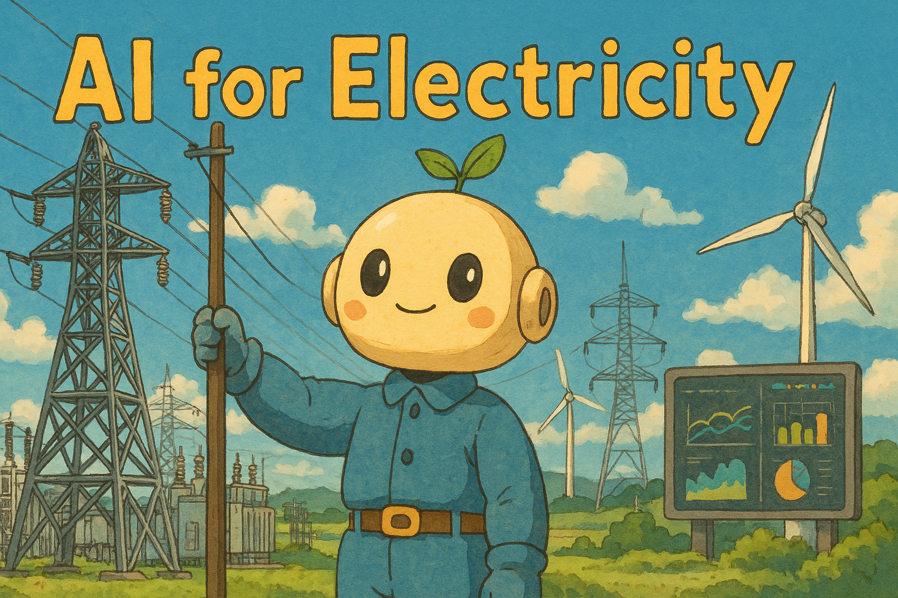

# 人工智能与电力电气交叉 [](https://github.com/sindresorhus/awesome)

<p align="center">
  <a href="">
    
  </a>
</p>

本项目为人工智能（AI）与电力工业交叉领域的精选资源库，内容涵盖高质量的论文、工具、数据集及相关资源，旨在为研究人员、工程师及技术爱好者提供一站式的信息平台，助力人工智能在电力系统中的研究与应用。

🔍 主要研究方向包括但不限于：智能电网、负荷预测、电力系统优化、电力市场机制、数字孪生等。

⚡️ **欢迎社区贡献！** 欢迎通过 Issue 或 Pull Request 提交新的资源或内容补充。

📩 如您拥有尚未收录的相关论文、技术报告或代码仓库，欢迎通过[***邮件***](mailto:rl4electric.ai@hotmail.com)联系，我们将积极审核并纳入本资源库中。


🔗 如果你觉得这个资源对你的研究有帮助，欢迎在项目和论文中引用我们的库，更准确的信息请参考 [**English Version**](./README.md):

```
@misc{AwesomeAI4Electricity, 
      author = {AI4Electricity Group}, 
      title = {Awesome AI for Electricity}, 
      year = {2025}, 
      url = {https://github.com/AI4Electricity/Awesome-AI-for-Electricity}
}
```

## 📦 Contents

- [人工智能与电力电气交叉 ](#人工智能与电力电气交叉-)
  - [📦 Contents](#-contents)
  - [综述](#综述)
  - [大模型工具](#大模型工具)
  - [论文分类](#论文分类)
  - [相关网站](#相关网站)
  - [开源数据集](#开源数据集)
  - [其它资源](#其它资源)

## 综述

<details open>
<summary><h3 style="margin: 0; display: inline-block">综述</h3></summary>

* **电力电子中人工智能技术的应用研究进展**  [[论文链接](https://ieeexplore.ieee.org/document/9200511)]
  * Zhao, Shuai and Blaabjerg, Frede and Wang, Huai, ***IEEE Transactions on Power Electronics***, *2020*

* **光伏功率预测的前沿技术与优化方法评述**  [[论文链接](https://www.sciencedirect.com/science/article/abs/pii/S1364032120300885)]
  * R. Ahmed, V. Sreeram, Y. Mishra, M.D. Arif, ***Renewable and Sustainable Energy Reviews***, 2020

* **面向电子设计自动化的图神经网络方法研究综述**  [[论文链接](https://ieeexplore.ieee.org/abstract/document/9531070)]
  * Lopera, Daniela Sanchez and Servadei, Lorenzo and Kiprit, Gamze Naz and Hazra, Souvik and Wille, Robert and Ecker, Wolfgang, ***MLCAD***, 2021

* **智能微电网中电力负荷与可再生能源预测的深度学习方法综述** [[论文链接](https://www.sciencedirect.com/science/article/pii/S1364032121002847)]
  * Aslam, Sheraz and Herodotou, Herodotos and Mohsin, Syed Muhammad and Javaid, Nadeem and Ashraf, Nouman and Aslam, Shahzad, ***Renewable and Sustainable Energy Reviews***, 2021

* **风电功率的确定性与概率性预测：模型、方法与研究展望**  [[论文链接](https://www.mdpi.com/2673-4826/2/1/2)]
  * Bazionis, Ioannis K., and Pavlos S. Georgilakis, ***Electricity***, 2021

* **面向可持续智能能源系统的数据驱动概率型机器学习：关键进展、挑战与未来研究方向**  [[论文链接](https://www.sciencedirect.com/science/article/pii/S1364032122000569)]
  * Ahmad, Tanveer and Madonski, Rafal and Zhang, Dongdong and Huang, Chao and Mujeeb, Asad, ***Renewable and Sustainable Energy Reviews***, 2022

* **能源与电力系统中的可解释人工智能技术：综述、挑战与机遇**  [[论文链接](https://www.sciencedirect.com/science/article/pii/S2666546822000246)]
  * Machlev, Ram and Heistrene, Leena and Perl, Michael and Levy, Kfir Yehuda and Belikov, Juri and Mannor, Shie and Levron, Yoash, ***Energy and AI***, 2022

* **机器学习在先进集成电路设计中的方法研究综述**  [[论文链接](https://ieeexplore.ieee.org/document/9927393)]
  * Chen, Tinghuan and Zhang, Grace Li and Yu, Bei and Li, Bing and Schlichtmann, Ulf, ***IEEE Design & Test***, 2022

* **现代电力系统规划与运行中的情景分析方法综述：方法、应用与挑战**  [[论文链接](https://www.sciencedirect.com/science/article/pii/S0378779621007033)]
  * Li, Hui and Ren, Zhouyang and Fan, Miao and Li, Wenyuan and Xu, Yan and Jiang, Yunpeng and Xia, Weiyi, ***Electric Power Systems Research***, 2022

* **电子设计自动化与图神经网络的理论与应用综述**  [[论文链接](https://dl.acm.org/doi/abs/10.1145/3543853)]
  * Sanchez, Daniela and Servadei, Lorenzo and Kiprit, Gamze Naz and Wille, Robert and Ecker, Wolfgang, ***ACM Transactions on Design Automation of Electronic Systems***, 2023

* **物联网与数字孪生在电力系统中的应用综述**  [[论文链接](https://ietresearch.onlinelibrary.wiley.com/doi/full/10.1049/gtd2.12940)]
  * Diaa-Eldin A. Mansour,  Mohamed Numair,  Amr S. Zalhaf,  Rawda Ramadan,  Mohamed M. F. Darwish,  Qi Huang,  Mohamed G. Hussien,  Omar Abdel-Rahim, ***IET Generation, Transmission & Distribution***, 2023

* **数字孪生技术在智能电网、交通系统与智能城市中的应用综述：面临的挑战与未来发展**  [[论文链接](https://ieeexplore.ieee.org/abstract/document/10034656)]
  * Mina Jafari and Abdollah Kavousi-Fard and Tao Chen and Mazaher Karimi, ***IEEE Access***, 2023

* **虚拟电厂的数据驱动型能源管理综述**  [[论文链接](https://www.sciencedirect.com/science/article/pii/S2666792424000088)]
  * Guangchun Ruan, Dawei Qiu, S. Sivaranjani, Ahmed S.A. Awad, Goran Strbac, ***Advances in Applied Energy***, 2024

* **电力与能源系统中安全强化学习策略的综述**  [[论文链接](https://www.sciencedirect.com/science/article/abs/pii/S0952197625000910)]
  * Van-Hai Bui, Sina Mohammadi, Srijita Das, Akhtar Hussain, Guilherme Vieira Hollweg, Wencong Su, ***Engineering Applications of Artificial Intelligence***, 2025

* **可再生能源电力系统运行中的人工智能方法综述**  [[论文链接](https://www.nature.com/articles/s44287-024-00018-9)]
  * Yuanzheng Li, Yizhou Ding, Shangyang He, Fei Hu, Juntao Duan, Guanghui Wen, Hua Geng, Zhengguang Wu, Hoay Beng Gooi, Yong Zhao, Chenghui Zhang, Shengwei Mei, Zhigang Zeng, ***Nature Reviews Electrical Engineering***, 2024

</details>

## 大模型工具
<details open>
<summary><h3 style="margin: 0; display: inline-block">大模型</h3></summary>

* **Time-LLM：基于大语言模型重编程的时间序列预测方法**  [[论文链接](https://arxiv.org/abs/2310.01728)] [[开源代码](https://github.com/KimMeen/Time-LLM)]
  * Ming Jin, Shiyu Wang, Lintao Ma, Zhixuan Chu, James Y. Zhang, Xiaoming Shi, Pin-Yu Chen, Yuxuan Liang, Yuan-Fang Li, Shirui Pan, Qingsong Wen, ***ICLR***, 2024

* **Time-MoE：基于专家混合机制的大规模时间序列基础模型**  [[论文链接](https://arxiv.org/abs/2409.16040)] [[开源代码](https://github.com/Time-MoE/Time-MoE)]
  * Xiaoming Shi and Shiyu Wang and Yuqi Nie and Dianqi Li and Zhou Ye and Qingsong Wen and Ming Jin, ***ICLR***, 2025

* **TimeMixer++：面向通用预测分析的时间序列模式建模方法**  [[论文链接](https://arxiv.org/abs/2410.16032)] [[开源代码](https://github.com/kwuking/TimeMixer)]
  * Shiyu Wang, Jiawei Li, Xiaoming Shi, Zhou Ye, Baichuan Mo, Wenze Lin, Shengtong Ju, Zhixuan Chu, Ming Jin, ***ICLR***, 2025

* **面向建筑级负荷预测的预训练大语言模型方法研究**  [[论文链接](https://ieeexplore.ieee.org/document/10917006)]
  * Yating Zhou, Meng Wang, ***IEEE Transactions on Power Systems***, 2025

* **基于大语言模型的报价行为代理与市场情绪代理辅助的电价预测研究**  [[论文链接](https://ieeexplore.ieee.org/abstract/document/10804210)]
  * Xin Lu, Jing Qiu, Yi Yang, Chenxi Zhang, Jiafeng Lin, Sihai An, ***IEEE Transactions on Energy Markets, Policy and Regulation***, 2024
</details>


## 论文分类

<details open>
<summary><h3 style="margin: 0; display: inline-block">智能电网</h3></summary>

* **面向多微电网配电系统的图学习电压调节方法**  [[论文链接](https://ieeexplore.ieee.org/document/10038542)]
  * Yi Wang, Dawei Qiu, Yu Wang, Mingyang Sun, Goran Strbac, ***IEEE Transactions on Power Systems***, 2023

* **面向光伏与储能系统的物理保护型多智能体强化学习电压控制方法**  [[论文链接](https://ieeexplore.ieee.org/document/9983850)]
  * Pengcheng Chen, Shichao Liu, Xiaozhe Wang, Innocent Kamwa, ***IEEE Transactions on Smart Grid***, 2023

* **基于深度强化学习的TSO-DSO协调下频率与电压的实时联合调控方法研究**  [[论文链接](https://ieeexplore.ieee.org/document/10208157)]
  * Ruoheng Wang, Siqi Bu, C. Y. Chung, ***IEEE Transactions on Smart Grid***, 2023

* **基于图感知深度强化学习的主动配电网动态重构与电压无功控制实时协调方法研究**  [[论文链接](https://ieeexplore.ieee.org/document/10285128)]
  * Ruoheng Wang, Xiaowen Bi, Siqi Bu, ***IEEE Transactions on Smart Grid***, 2023

* **CuEMS：基于深度强化学习的微电网社区能源管理系统控制方法**  [[论文链接](https://www.sciencedirect.com/science/article/abs/pii/S0378778823010952)]
  * Jianbin Li, Zeshuo Jiang, Zhiqiang Chen, Jinwei Liu, Long Cheng, ***Energy and Buildings***, 2024

* **面向多振荡源定位的知识引导型深度学习方法**  [[论文链接](https://ieeexplore.ieee.org/document/10854907)]
  * Zhenjie Cui, Weihao Hu, Guozhou Zhang, Qi Huang, Zhe Chen, Frede Blaabjerg, ***IEEE Transactions on Power Systems***, 2025

* **面向机组组合问题的强化学习嵌入式代理拉格朗日松弛快速求解方法**  [[论文链接](https://ieeexplore.ieee.org/document/10847790)]
  * Yuhang Zhu, Gaochen Cui, Anbang Liu, Qing-Shan Jia, Xiaohong Guan, Qiaozhu Zhai, ***IEEE Transactions on Power Systems***, 2025

* **基于图神经网络的电力系统多稳态风险实时评估与可视化方法研究**  [[论文链接](https://ieeexplore.ieee.org/document/10819251)]
  * Qifan Chen, Siqi Bu, Huaiyuan Wang, Chao Lei, ***IEEE Transactions on Power Systems***, 2025

* **基于输入凸神经网络的虚拟电厂无模型聚合方法研究**  [[论文链接](https://ieeexplore.ieee.org/abstract/document/10916791)]
  * Wei Lin, Yi Wang, Jianghua Wu, Fei Feng, ***IEEE Transactions on Smart Grid***, 2025

* **基于物理引导自监督预训练的图神经网络大规模电力系统分析泛化能力提升方法**  [[论文链接](https://ieeexplore.ieee.org/document/10901974)]
  * Yuhong Zhu, Yongzhi Zhou, Wei Wei, Peng Li, and Wenqi Huang, ***IEEE Transactions on Power Systems***, 2025

* **面向主动配电网分布式Volt-Var控制的灵敏度驱动异构有序多智能体强化学习方法**  [[论文链接](https://ieeexplore.ieee.org/document/10879343)]
  * Xiaodong Zheng, Shixuan Yu, Hui Cao, Tianzhuo Shi, Shuangsi Xue, Tao Ding, ***IEEE Transactions on Smart Grid***, 2025

* **基于强化学习的高速公路电动汽车充电稳定能源管理方法研究**  [[论文链接](https://www.sciencedirect.com/science/article/abs/pii/S0306261925002715)]
  * Hongbin Xie, Ge Song, Zhuoran Shi, Likun Peng, Defan Feng, Xuan Song, ***Applied Energy***, 2025

* **基于多智能体博弈强化学习的灵活牵引供电系统储能协同能源管理方法**  [[论文链接](https://ieeexplore.ieee.org/document/10884593)]
  * Jiaming Luo, Yating Wang, Shibin Gao, Xiaoguang Wei, Zhongbei Tian, Jian Shi, ***IEEE Transactions on Transportation Electrification***, 2025

</details>


<details open>
<summary><h3 style="margin: 0; display: inline-block">能耗预测</h3></summary>

* **面向可持续电力供应的智能电网中基于区块链与机器学习的点对点能源交易机制** [[论文链接](https://ieeexplore.ieee.org/abstract/document/9358144)]
  * Jamil, Faisal and Iqbal, Naeem and Ahmad, Shabir and Kim, Dohyeun and others, ***IEEE Access***, *2021*

* **基于机器学习的智能建筑能耗预测方法研究：以马来西亚为案例** [[论文链接](https://www.sciencedirect.com/science/article/pii/S266616592030034X)]
  * Shapi, Mel Keytingan M and Ramli, Nor Azuana and Awalin, Lilik J, ***Developments in the Built Environment***, *2021*

* **Autoformer：基于序列分解与自相关机制的长期时间序列预测Transformer模型**  [[论文链接](https://arxiv.org/abs/2106.13008)] [[开源代码](https://github.com/thuml/Autoformer)]
  * Haixu Wu and Jiehui Xu and Jianmin Wang and Mingsheng Long, ***NeurIPS***, 2021

* **基于CNN-LSTM的短期光伏发电预测混合深度学习模型研究**  [[论文链接](https://www.sciencedirect.com/science/article/pii/S0378779622001389)]
  * Agga, Ali and Abbou, Ahmed and Labbadi, Moussa and El Houm, Yassine and Ali, Imane Hammou Ou, ***Electric Power Systems Research***, 2022

* **iTransformer：用于时间序列预测的倒置Transformer结构模型研究**  [[论文链接](https://arxiv.org/abs/2310.06625)] [[开源代码](https://github.com/thuml/iTransformer)]
  * Yong Liu, Tengge Hu, Haoran Zhang, Haixu Wu, Shiyu Wang, Lintao Ma, Mingsheng Long, ***ICLR***, 2024

</details>


<details open>
<summary><h3 style="margin: 0; display: inline-block">时间序列分析</h3></summary>

* **T-CGAN：面向不规则采样噪声时间序列的数据增强生成对抗网络方法**  [[论文链接](https://arxiv.org/abs/1811.08295)] [[开源代码](https://github.com/gioramponi/GAN_Time_Series)]
  * Giorgia Ramponi, Pavlos Protopapas, Marco Brambilla, Ryan Janssen, ***arxiv***, 2019

* **面向时间序列建模的生成对抗网络方法研究**  [[论文链接](http://papers.neurips.cc/paper/8789-time-series-generative-adversarial-networks.pdf)] [[开源代码](https://bitbucket.org/mvdschaar/mlforhealthlabpub/src/master/alg/timegan/)]
  * J Yoon, D Jarrett, M Van der Schaar, ***NeurIPS***, 2019

* **面向非均匀时间序列的神经控制微分方程建模方法**  [[论文链接](https://arxiv.org/pdf/2005.08926)] [[开源代码](https://github.com/google-research/torchsde)]
  * Patrick Kidger, James Morrill, James Foster, Terry Lyons, ***NeurIPS***, 2020

* **GT-GAN：用于广泛时序任务的生成对抗网络建模方法**  [[论文链接](http://arxiv.org/abs/2210.02040)]
  * Jinsung Jeon, JEONGHAK KIM, Haryong Song, Seunghyeon Cho, Noseong Park, ***NeurIPS***, 2022

* **基于深度潜在状态空间建模的时间序列生成方法研究**  [[论文链接](https://arxiv.org/abs/2212.12749)] [[开源代码](https://github.com/alexzhou907/ls4)]
  * Zhou, Linqi and Poli, Michael and Xu, Winnie and Massaroli, Stefano and Ermon, Stefano, ***ICML***, 2023

* **TSGBench：面向时间序列生成任务的基准测试框架研究**  [[论文链接](https://www.vldb.org/pvldb/vol17/p305-huang.pdf)] [[开源代码](https://github.com/YihaoAng/TSGBench)]
  * Ang, Yihao and Huang, Qiang and Bao, Yifan and Tung, Anthony KH and Huang, Zhiyong, ***VLDB***, 2023

* **用于光伏时序动态模拟的融合Bi-LSTM与风格迁移的生成对抗网络新架构**  [[论文链接](https://ieeexplore.ieee.org/document/10601515)]
  * Xueqian Fu, Chunyu Zhang, Xiurong Zhang, Hongbin Sun, ***IEEE Transactions on Sustainable Energy***, 2024

* **基于多时间尺度递归神经网络的锂离子电池模型参数与荷电状态在线估计方法**  [[论文链接](https://ieeexplore.ieee.org/document/10851407)]
  * Zepei Zhang, Yuan Fan, Jiaqiang Tian, Huyong Kuang, Mince Li, Tianhong Pan, ***IEEE Transactions on Industrial Electronics***, 2025

</details>


<details open>
<summary><h3 style="margin: 0; display: inline-block">电力负荷与可再生能源功率预测</h3></summary>

* **基于LiDAR-SCADA融合的深度学习短期风电功率预测模型精度研究：以400 MW Anholt海上风电场为例**  [[论文链接](https://www.sciencedirect.com/science/article/pii/S0306261924012650)]
  * D Kim, G Ryu, C Moon, B Kim, ***Applied Energy***, 2024

* **风电功率预测中气象因素贡献的可解释人工智能分析与机器学习方法研究**  [[论文链接](https://doi.org/10.1063/5.0127519)]
  * Kim, Dae-Young, and Bum-Suk Kim, ***Journal of Renewable and Sustainable Energy***, 2023

* **基于Transformer的风电功率预测深度学习模型研究**  [[论文链接](https://www.frontiersin.org/articles/10.3389/fenrg.2022.1055683/full)]
  * Huang, Sheng, Chang Yan, and Yinpeng Qu, ***Frontiers in Energy Research***, 2023

* **基于生成对抗网络与二次模态分解的小样本风电功率预测新模型**  [[论文链接](https://www.frontiersin.org/articles/10.3389/fenrg.2023.1211360/full)]
  * He, Hang, and Manman Yuan, ***Frontiers in Energy Research***, 2023

* **基于多梯度下降与奇偶一致性的联邦学习协同短期负荷预测方法研究**  [[论文链接](https://ieeexplore.ieee.org/document/10577590)]
  * Haijin Wang, Shuangshuang Xing, Caomingzhe Si, Zibin Pan, Junhua Zhao, Jing Qiu, ***IEEE Transactions on Power Systems***, 2024

* **基于LSTM与Transformer融合结构的电力负荷预测方法**  [[论文链接](https://ieeexplore.ieee.org/document/10887006)]
  * Vasileios Pentsos, Spyros Tragoudas, Jason Wibbenmeyer, Nasser Khdeer, ***IEEE Transactions on Smart Grid***, 2025

* **面向短期多序列负荷预测的并行时空图注意力建模方法**  [[论文链接](https://ieeexplore.ieee.org/document/10753650)]
  * Long Zhuo, Xu ZhiYuan, Wu Gongping, Deng Feng, Chen Xiangyuan, Feng Wenshan, ***IEEE Transactions on Power Delivery***, 2025

</details>


<details open>
<summary><h3 style="margin: 0; display: inline-block">电力市场与交易机制研究</h3></summary>

* **基于深度强化学习的热电联产系统智能经济调度方法研究**  [[论文链接](https://www.sciencedirect.com/science/article/abs/pii/S0142061519336713)]
  * Suyang Zhou, Zijian Hu, Wei Gu, Meng Jiang, Meng Chen, Qiteng Hong, Campbell Booth, ***International Journal of Electrical Power & Energy Systems***, 2020

* **基于多智能体深度强化学习的互联多能源微电网点对点能源交易与能量转换研究**  [[论文链接](https://ieeexplore.ieee.org/document/9596598)]
  * Tianyi Chen, Shengrong Bu, Xue Liu, Jikun Kang, F. Richard Yu, Zhu Han, ***IEEE Transactions on Smart Grid***, 2021

* **虚拟电厂在日前市场中的安全强化学习策略报价方法**  [[论文链接](https://arxiv.org/pdf/2307.05812)]
  * Stanojev, Ognjen and Mitridati, Lesia and Di Prata, Riccardo de Nardis and Hug, Gabriela, ***IEEE International Conference on Communications, Control, and Computing Technologies for Smart Grids***, 2023

* **面向配电网实时拥塞管理的充电站动态激励定价策略：一种自适应模型驱动的安全深度强化学习方法**  [[论文链接](https://ieeexplore.ieee.org/document/10298595)]
  * Hongrong Yang, Yinliang Xu, Qinglai Guo, ***IEEE Transactions on Sustainable Energy***, 2023

* **多区域电力市场应对极端事件的风险共担双层优化建模方法**  [[论文链接](https://ieeexplore.ieee.org/abstract/document/10623792)]
  * Jianing Lin, Minglei Bao, Yanqiu Hou, Yi Ding, Zhenglin Yang, ***IEEE Transactions on Power Systems***, 2024

* **基于高反应速率不匹配模块化电化学合成的多电力市场利用机制研究**  [[论文链接](https://www.nature.com/articles/s41560-024-01578-8)]
  * Rui Wang, Jiaze Ma, Hongyuan Sheng, Victor M. Zavala, Song Jin, ***Nature Energy***, 2024

* **面向绿色电力预测与交易的园区综合能源系统集群多目标协同优化策略**  [[论文链接](https://www.sciencedirect.com/science/article/abs/pii/S0360544225006978)]
  * Yanbin Li, Weikun Hu, Feng Zhang, Yun Li, ***Energy***, 2025

* **电力市场不确定环境下的鲁棒强化学习决策优化方法**  [[论文链接](https://ieeexplore.ieee.org/document/10759306)]
  * Dawei Qiu, Jianhong Wang, Guangchun Ruan, Qianzhi Zhang, Goran Strbac, ***IEEE Transactions on Power Systems***, 2025

* **面向电力配电网与电动汽车高效协同的鲁棒深度强化学习方法研究**  [[论文链接](https://ieeexplore.ieee.org/document/10869396)]
  * Peiyue Li, Sheng Chen, Zhinong Wei, Qiuwei Wu, Guoqiang Sun, Jiahui Jin, ***IEEE Transactions on Transportation Electrification***, 2025

</details>


<details open>
<summary><h3 style="margin: 0; display: inline-block">电网安全与隐私保护</h3></summary>

* **面向碳感知产消者的点对点能源交易：具备差分隐私的在线加速分布式优化方法**  [[论文链接](https://ieeexplore.ieee.org/document/10525236)]
  * Xuan Wei, Yinliang Xu, Hongbin Sun, Wai Kin Chan, ***IEEE Transactions on Smart Grid***, 2024

* **面向主动配电网调度的模型驱动型安全强化学习方法研究**  [[论文链接](https://ieeexplore.ieee.org/abstract/document/10930731)]
  * Yuxiang Guan, Wenhao Ma, Liang Che, Mohammad Shahidehpour, ***IEEE Transactions on Smart Grid***, 2025

* **基于深度强化学习的抗多模态对抗攻击鲁棒光伏功率预测方法研究**  [[论文链接](https://ieeexplore.ieee.org/document/10935707)]
  * Jingxuan Liu, Haixiang Zang, Lilin Cheng, Tao Ding, Zhinong Wei, Guoqiang Sun, ***IEEE Transactions on Sustainable Energy***, 2025

* **基于NARX神经网络的电动汽车充电网络虚假数据注入攻击检测方法研究**  [[论文链接](https://ieeexplore.ieee.org/document/10935626)]
  * Habila Basumatary, Manas Khatua, Shabari Nath, ***IEEE Transactions on Transportation Electrification***, 2025

* **基于谱图神经网络的智能电网虚假数据注入攻击检测方法研究**  [[论文链接](https://ieeexplore.ieee.org/document/10925433)]
  * Na Li, Jing Zhang, Dongming Ma, Jun Ding, ***IEEE Transactions on Industrial Informatics***, 2025

</details>


<details open>
<summary><h3 style="margin: 0; display: inline-block">异常检测方法</h3></summary>

* **融合微时刻感知与改进K近邻的建筑用电行为异常识别方法**  [[论文链接](https://onlinelibrary.wiley.com/doi/abs/10.1002/int.22404)]
  * Yassine Himeur, Abdullah Alsalemi, Faycal Bensaali, Abbes Amira, ***International Journal of Intelligent Systems***, 2021

* **基于深度自编码器的智能电网电力窃取网络攻击异常检测方法研究**  [[论文链接](https://ieeexplore.ieee.org/abstract/document/9674027)]
  * Abdulrahman Takiddin, Muhammad Ismail, Usman Zafar, Erchin Serpedin, ***IEEE Systems Journal***, 2022

* **基于人工智能的风电设备异常检测系统与方法研究**  [[论文链接](https://www.sciencedirect.com/science/article/pii/S2666202724000119)]
  * Xian Ding, Yongli Gong, Chaodong Wang, Zhishuai Zheng, ***International Journal of Thermofluids***, 2024

* **面向智能电网的联邦学习LSTM-自编码器异常检测方法研究**  [[论文链接](https://www.sciencedirect.com/science/article/pii/S0743731524001151)]
  * Rakesh Shrestha, Mohammadreza Mohammadi, Sima Sinaei, Alberto Salcines, David Pampliega, Raul Clemente, Ana Lourdes Sanz, Ehsan Nowroozi, Anders Lindgren, ***Journal of Parallel and Distributed Computing***, 2024

* **基于同步相量数据的无监督机器学习在线电压安全评估方法研究**  [[论文链接](https://ieeexplore.ieee.org/document/10937098)]
  * Han Gao, Deyou Yang, Yanling Lv, Lixin Wang, ***IEEE Transactions on Power Systems***, 2025

* **OD-TGCN：一种基于观察者驱动的时序图卷积网络用于控制系统早期故障检测**  [[论文链接](https://ieeexplore.ieee.org/document/10909981)]
  * Yuxiang Hu, Xuewu Dai, Peng Yue, Jinliang Ding, Tianyou Chai, ***IEEE Transactions on Circuits and Systems***, 2025

* **面向变压器油溶解气体智能诊断的电子鼻与机器学习结合方法**  [[论文链接](https://ieeexplore.ieee.org/document/10836134)]
  * Suganya Govindarajan, Harimurugan Devarajan, Jorge Alfredo Ardila-Rey, Matías Patricio Cerda-Luna, Sergi Leandro Torres Araya, Cristhian Camilo Delgado Diaz, ***IEEE Transactions on Industrial Informatics***, 2025

</details>


<details open>
<summary><h3 style="margin: 0; display: inline-block">图像识别与模式识别</h3></summary>

* **基于深度学习的电路识别方法研究**  [[论文链接](https://ieeexplore.ieee.org/abstract/document/7951826)]
  * Dai, Yu-Yun and Braytont, Robert K, ***HOST***, 2017

* **基于深度学习的电路识别方法：稀疏映射与衰减求和表示技术**  [[论文链接](https://ieeexplore.ieee.org/abstract/document/8715251)]
  * Fayyazi, Arash and Shababi, Soheil and Nuzzo, Pierluigi and Nazarian, Shahin and Pedram, Massoud, ***DATE***, 2019

* **基于两阶段卷积神经网络的手绘电气电子电路元件识别系统研究**  [[论文链接](https://link.springer.com/article/10.1007/s00521-021-05964-1)]
  * Dey, Mrityunjoy and Mia, Shoif Md and Sarkar, Navonil and Bhattacharya, Archan and Roy, Soham and Malakar, Samir and Sarkar, Ram, ***Neural Computing and Applications***, 2021

* **基于端到端深度学习框架的印刷电路板制造缺陷分类方法研究**  [[论文链接](https://www.nature.com/articles/s41598-022-16302-3)]
  * Bhattacharya, Abhiroop and Cloutier, Sylvain G, ***Scientific Reports***, 2022

* **基于目标检测与节点识别的手绘电气电路识别方法研究**  [[论文链接](https://arxiv.org/abs/2106.11559)]
  * Rachala, Rohith Reddy and Panicker, Mahesh Raveendranatha, ***SN Computer Science***, 2022

* **面向馈线故障检测的全卷积生成对抗网络图像识别方法：高可靠性检测研究**  [[论文链接](https://ieeexplore.ieee.org/document/10820194)]
  * Jiawei Yuan, Lifeng Xing, Mingjun Xue, Qi Chen, Bing Hu, Xi Chen, ***IEEE Transactions on Smart Grid**, 2025

* **面向无人机图像的输电线分割的混合Transformer U-Net模型**  [[论文链接](https://ieeexplore.ieee.org/document/10877786)] [[开源代码](https://github.com/xiachengs/MiT-Unet)]
  * Ning Wei, Jianwei Chen, Shuifa Sun, ***IEEE Transactions on Power Delivery**, 2025

* **基于DCGAN-Yolov5的多源局部放电模式识别算法研究**  [[论文链接](https://ieeexplore.ieee.org/document/10004512)]
  * Min Wu, Wei Jiang, Daoyi Shen, Yingting Luo, Junjie Yang, ***IEEE Transactions on Power Delivery**, 2025

* **面向城市道路电动汽车停车与充电容量的深度学习增强街景图像分析框架**  [[论文链接](https://www.sciencedirect.com/science/article/pii/S0306261925005252)]
  * Yifan Pu, Rui Zhu, Shu Wang, Linlin You, Teng Zhong, Yanqing Xu, Zheng Qin, ***Applied Energy**, 2025

* **基于知识蒸馏与对比学习的分离错位配准网络在可见光-红外输电线检测中的应用**  [[论文链接](https://ieeexplore.ieee.org/document/10820014)] [[开源代码](https://github.com/WangYuSenn/SSRNet-KD)]
  * Wujie Zhou, Yusen Wang, Xiaohong Qian, ***IEEE Transactions on Circuits and Systems**, 2025

</details>


<details open>
<summary><h3 style="margin: 0; display: inline-block">电路设计与优化方法</h3></summary>

* **基于多目标采集集成的批量贝叶斯优化在自动化模拟电路设计中的应用**  [[论文链接](https://proceedings.mlr.press/v80/lyu18a/lyu18a.pdf)]
  * Lyu, Wenlong and Yang, Fan and Yan, Changhao and Zhou, Dian and Zeng, Xuan, ***ICML***, 2018

* **电路设计自动化方法**  [[论文链接](https://arxiv.org/pdf/1812.02734)]
  * Wang, Hanrui and Yang, Jiacheng and Lee, Hae-Seung and Han, Song, ***NeurIPS Workshop***, 2018

* **Circuit-GNN：面向分布式电路设计的图神经网络方法研究**  [[论文链接](https://proceedings.mlr.press/v97/zhang19e/zhang19e.pdf)]
  * Zhang, Guo and He, Hao and Katabi, Dina, ***ICML***, 2019

* **GCN-RL电路设计器：基于图神经网络与强化学习的可迁移晶体管尺寸优化方法**  [[论文链接](https://arxiv.org/abs/2005.00406)]
  * Wang, Hanrui and Wang, Kuan and Yang, Jiacheng and Shen, Linxiao and Sun, Nan and Lee, Hae-Seung and Han, Song, ***DAC***, 2020

* **ParaGraph：基于图神经网络的电路布局寄生效应与器件参数预测方法**  [[论文链接](https://ieeexplore.ieee.org/document/9218515)]
  * Ren, Haoxing and Kokai, George F and Turner, Walker J and Ku, Ting-Sheng, ***DAC***, 2020

* **面向快速芯片设计的图布局方法研究**  [[论文链接](https://www.nature.com/articles/s41586-021-03544-w)]
  * Mirhoseini, Azalia and Goldie, Anna and Yazgan, Mustafa and Jiang, Joe Wenjie and Songhori, Ebrahim and Wang, Shen and Lee, Young-Joon and Johnson, Eric and Pathak, Omkar and Nova, Azade and others, ***Nature***, 2021

* **PrefixRL：基于深度强化学习的并行前缀电路优化方法**  [[论文链接](https://arxiv.org/abs/2205.07000)]
  * Roy, Rajarshi and Raiman, Jonathan and Kant, Neel and Elkin, Ilyas and Kirby, Robert and Siu, Michael and Oberman, Stuart and Godil, Saad and Catanzaro, Bryan, ***DAC***, 2021

* **面向前缀加法器设计的多目标强化学习方法：自适应帕累托重置策略**  [[论文链接](http://mlforsystems.org/assets/papers/neurips2022/paper20.pdf)]
  * Song, Jialin and Roy, Rajarshi and Raiman, Jonathan and Kirby, Robert and Kant, Neel and Godil, Saad and Catanzaro, Bryan, ***NeruIPS Workshop***, 2022

* **利用领域知识与深度强化学习的自动化模拟电路设计方法**  [[论文链接](https://arxiv.org/abs/2202.13185)]
  * Cao, Weidong and Benosman, Mouhacine and Zhang, Xuan and Ma, Rui, ***AAAI Workshop***, 2022

* **硬件加速器设计中的连续且可重构潜在空间学习方法**  [[论文链接](https://ieeexplore.ieee.org/document/9804604)] [[开源代码](https://github.com/ucb-bar/vaesa)]
  * Huang, Qijing and Hong, Charles and Wawrzynek, John and Subedar, Mahesh and Shao, Yakun Sophia, ***ISPASS***, 2022

* **面向模拟集成电路设计的深度强化学习拓扑结构合成方法**  [[论文链接](https://ieeexplore.ieee.org/abstract/document/9718525)]
  * Zhao, Zhenxin and Zhang, Lihong, ***IEEE Transactions on Computer-Aided Design of Integrated Circuits and Systems***, 2022

* **GPT4AIGChip：基于大型语言模型的下一代AI加速器设计自动化研究**  [[论文链接](https://arxiv.org/abs/2309.10730)]
  * Fu, Yonggan and Zhang, Yongan and Yu, Zhongzhi and Li, Sixu and Ye, Zhifan and Li, Chaojian and Wan, Cheng and Lin, Yingyan Celine, ***ICCAD***, 2023

* **面向射频电路的前布局寄生效应优化设计：基于图神经网络的方法**  [[论文链接](https://www.mdpi.com/2079-9292/12/2/465)]
  * Li, Chenfeng and Hu, Dezhong and Zhang, Xiaoyan, ***Electronics***, 2023

* **ChipNeMo：面向芯片设计的领域自适应大语言模型方法**  [[论文链接](https://arxiv.org/abs/2311.00176)]
  * Liu, Mingjie and Ene, Teodor-Dumitru and Kirby, Robert and Cheng, Chris and Pinckney, Nathaniel and Liang, Rongjian and Alben, Jonah and Anand, Himyanshu and Banerjee, Sanmitra and Bayraktaroglu, Ismet and others, ***arxiv***, 2023

* **CircuitSeer：通过功能与结构表示耦合进行RTL后PnR延迟预测的方法**  [[论文链接](https://2024.iccad.com/accepted-papers)]
  * authors, ***ICCAD***, 2024

* **AMSNet：面向AMS电路的网表数据集研究**  [[论文链接](https://arxiv.org/abs/2405.09045)]
  * Tao, Zhuofu and Shi, Yichen and Huo, Yiru and Ye, Rui and Li, Zonghang and Huang, Li and Wu, Chen and Bai, Na and Yu, Zhiping and Lin, Ting-Jung and others, ***LAD Workshop***, 2024

* **面向标准单元布局设计优化的大语言模型方法研究**  [[论文链接](https://arxiv.org/abs/2406.06549)]
  * Ho, Chia-Tung and Ren, Haoxing, ***LAD Workshop***, 2024

* **MG-Verilog：面向增强LLM辅助Verilog代码生成的多粒度数据集研究**  [[论文链接](https://ieeexplore.ieee.org/abstract/document/10691738)]
  * Zhang, Yongan and Yu, Zhongzhi and Fu, Yonggan and Wan, Cheng and Lin, Yingyan Celine, ***LAD Workshop***, 2024

* **AICircuit：AI驱动的模拟集成电路设计多层次数据集与基准测试平台研究**  [[论文链接](https://arxiv.org/abs/2407.18272)] [[开源代码](https://github.com/AvestimehrResearchGroup/AICircuit)]
  * Mehradfar, Asal and Zhao, Xuzhe and Niu, Yue and Babakniya, Sara and Alesheikh, Mahdi and Aghasi, Hamidreza and Avestimehr, Salman, ***NeurIPS Workshop***, 2024

* **面向电路优化的高效可扩展潜在空间方法：CircuitVAE模型**  [[论文链接](https://arxiv.org/pdf/2406.09535)]
  * Song, Jialin and Swope, Aidan and Kirby, Robert and Roy, Rajarshi and Godil, Saad and Raiman, Jonathan and Catanzaro, Bryan, ***DAC***, 2024

* **基于大语言模型辅助的高效硬件设计自动化方法研究**  [[论文链接](https://arxiv.org/pdf/2410.18582v1)]
  * Xu, Kangwei and Qiu, Ruidi and Zhao, Zhuorui and Zhang, Grace Li and Schlichtmann, Ulf and Li, Bing, ***arxiv***, 2024

* **面向乘法器设计优化的RL-MUL 2.0方法：并行深度强化学习与空间压缩技术**  [[论文链接](https://arxiv.org/pdf/2404.00639)]
  * Zuo, Dongsheng and Zhu, Jiadong and Ouyang, Yikang and Ma, Yuzhe, ***ACM Transactions on Design Automation of Electronic Systems***, 2024

* **深度学习驱动的多端口射频与亚太赫兹无源组件及集成电路广义逆向设计**  [[论文链接](https://www.nature.com/articles/s41467-024-54178-1)]
  * Karahan, Emir Ali and Liu, Zheng and Gupta, Aggraj and Shao, Zijian and Zhou, Jonathan and Khankhoje, Uday and Sengupta, Kaushik, ***Nature Communications***, 2024

* **面向芯片设计的基于LLM的分层提示优化方法**  [[论文链接](https://arxiv.org/abs/2407.18276)]
  * Nakkab, Andre and Zhang, Sai Qian and Karri, Ramesh and Garg, Siddharth, ***MLCAD***, 2024

* **PyHDL-Eval：基于Python嵌入DSL的硬件设计评估框架与LLM应用研究**  [[论文链接](https://dl.acm.org/doi/10.1145/3670474.3685948)]
  * Batten, Christopher and Pinckney, Nathaniel and Liu, Mingjie and Ren, Haoxing and Khailany, Brucek, ***MLCAD***, 2024

* **数据驱动的芯片设计：通过自动化设计-数据增强框架微调LLM模型**  [[论文链接](https://dl.acm.org/doi/10.1145/3649329.3657356)]
  * Chang, Kaiyan and Wang, Kun and Yang, Nan and Wang, Ying and Jin, Dantong and Zhu, Wenlong and Chen, Zhirong and Li, Cangyuan and Yan, Hao and Zhou, Yunhao and others, ***DAC***, 2024

* **模拟与射频电路设计中的监督学习：基准测试与比较分析**  [[论文链接](https://arxiv.org/abs/2501.11839)]
  * Mehradfar, Asal and Zhao, Xuzhe and Niu, Yue and Babakniya, Sara and Alesheikh, Mahdi and Aghasi, Hamidreza and Avestimehr, Salman, ***arxiv***, 2025

* **LayoutCopilot：基于LLM的多智能体协作框架在互动模拟电路布局设计中的应用**  [[论文链接](https://arxiv.org/pdf/2406.18873)]
  * Liu, Bingyang and Zhang, Haoyi and Gao, Xiaohan and Kong, Zichen and Tang, Xiyuan and Lin, Yibo and Wang, Runsheng and Huang, Ru, ***IEEE Transactions on Computer-Aided Design of Integrated Circuits and Systems***, 2025

* **DeepCircuitX：用于RTL代码理解、生成与PPA分析的综合性数据集**  [[论文链接](https://arxiv.org/abs/2502.18297)]
  * Li, Zeju and Xu, Changran and Shi, Zhengyuan and Peng, Zedong and Liu, Yi and Zhou, Yunhao and Zhou, Lingfeng and Ma, Chengyu and Zhong, Jianyuan and Wang, Xi and others, ***arxiv***, 2025

* **面向非线性电路宏建模的注意力机制与深度递归网络结合方法**  [[论文链接](https://ieeexplore.ieee.org/document/10769471)]
  * Sina Soleimani, Sayed Alireza Sadrossadat, Weicong Na, Qi-Jun Zhang, ***IEEE Transactions on Circuits and Systems***, 2025

* **仿生神经形态电路设计：非关联学习在多感官增强与抑郁症中的应用**  [[论文链接](https://ieeexplore.ieee.org/document/10917003)]
  * Mingxuan Jiang, Yutong Zhang, Ningye Jiang, Qiang Xiao, Zhigang Zeng, ***IEEE Transactions on Circuits and Systems***, 2025

</details>


<details open>
<summary><h3 style="margin: 0; display: inline-block">数字孪生</h3></summary>

* **面向能源消耗的数字孪生驱动决策与规划方法**  [[论文链接](https://www.mdpi.com/2224-2708/10/2/37)]
  * Fathy, Yasmin and Jaber, Mona and Nadeem, Zunaira, ***Journal of Sensor and Actuator Networks***, 2021

* **微电网数字孪生技术：概念、应用与未来发展趋势**  [[论文链接](https://ieeexplore.ieee.org/document/9663369)]
  * Bazmohammadi, Najmeh and Madary, Ahmad and Vasquez, Juan C and Mohammadi, Hamid Baz and Khan, Baseem and Wu, Ying and Guerrero, Josep M, ***IEEE Access***, 2021

* **面向电力厂及复杂工程系统的数字孪生技术：鲁棒数字孪生模型在能源行业中的应用**  [[论文链接](https://www.sciencedirect.com/science/article/pii/S2352484722005522)]
  * Ahmad K. Sleiti and Jayanta S. Kapat and Ladislav Vesely, ***Energy Reports***, 2022

* **基于机器学习的风力涡轮机预测建模数字孪生技术研究**  [[论文链接](https://ieeexplore.ieee.org/abstract/document/9696318)]
  * M Fahim, V Sharma, TV Cao, B Canberk, TQ Duong, ***IEEE Access***, 2022

* **基于数字孪生与机器学习的热电厂燃烧发动机决策支持方法**  [[论文链接](https://www.sciencedirect.com/science/article/pii/S095070512200795X)]
  * B. Deon and K.P. Cotta and R.F.V. Silva and C.B. Batista and G.T. Justino and G.C. Freitas and A.M. Cordeiro and A.S. Barbosa and F.L. Loucao and T. Simioni and A.M. Morais and I.E.A. Medeiros and R.J.S. Almeida and C.A.A. Araújo Jr. and C. Soares and N. Padoin, ***Knowledge-Based Systems***, 2022

* **面向低碳电气设备管理的云-边-端协作数字孪生：可靠性与通信效率研究**  [[论文链接](https://ieeexplore.ieee.org/abstract/document/9844869)]
  * Haijun Liao and Zhenyu Zhou and Nian Liu and Yan Zhang and Guangyuan Xu and Zhenti Wang, ***IEEE Transactions on Industrial Informatics***, 2022

* **面向智能电网的数字孪生驱动SDN：深度学习与区块链集成的网络安全方法**  [[论文链接](https://www.sciencedirect.com/science/article/pii/S0038092X23005546)]
  * Kumar, Prabhat and Kumar, Randhir and Aljuhani, Ahamed and Javeed, Danish and Jolfaei, Alireza and Islam, AKM Najmul, ***Solar Energy***, 2023


</details>


## 相关网站
* [电路板布局自动化](https://www.quilter.ai)

* [基于人工智能的电子设计自动化工具](https://www.flux.ai/p)


## 开源数据集

<details open>
<summary><h3 style="margin: 0; display: inline-block">数据集</h3></summary>

* **低能耗住宅中家电能耗的基于数据驱动的预测模型研究**  [[论文链接](https://www.sciencedirect.com/science/article/pii/S0378778816308970)] [[开源代码](https://www.kaggle.com/datasets/loveall/appliances-energy-prediction/data)]
  * Luis M. Candanedo and Véronique Feldheim and Dominique Deramaix, ***Energy and Buildings***, 2017

* **基于深度神经网络的长期与短期时序模式建模方法**  [[论文链接](https://arxiv.org/pdf/1703.07015)] [[开源代码](https://github.com/laiguokun/multivariate-time-series-data)]
  * Guokun, Lai and Wei-Cheng, Chang and Yiming, Yang and Hanxiao, Liu, ***ACM SIGIR Conference on Research & Development in Information Retrieval***, 2018

* **Monash时间序列预测数据存档**  [[论文链接](https://arxiv.org/abs/2105.06643)] [[开源代码](https://github.com/rakshitha123/TSForecasting)]
  * Godahewa R W, Bergmeir C, Webb G I, et al. Monash Time Series Forecasting Archive, ***NeurIPS***, 2021

* **Neuralprophet数据集**  [[开源代码](https://github.com/ourownstory/neuralprophet-data)]

* **Buildingsbench：用于短期负荷预测的90万建筑大规模数据集与基准测试**  [[论文链接](https://arxiv.org/abs/2307.00142)] [[开源代码](https://github.com/NREL/BuildingsBench)]
  * Emami, Patrick and Sahu, Abhijeet and Graf, Peter, ***NeurIPS***, 2023

* **面向电力负荷预测的基准测试与定制软件包应用研究**  [[论文链接](https://arxiv.org/abs/2307.07191)] [[开源代码](https://github.com/Leo-VK/EnFoAV)]
  * Zhixian Wang, Qingsong Wen, Chaoli Zhang, Liang Sun, Leandro Von Krannichfeldt, Shirui Pan, Yi Wang, ***arxiv***, 2023

</details>


## 其它资源

* [时间序列分析工具库](https://github.com/thuml/Time-Series-Library)

* [基于Python的离群值与异常检测库](https://github.com/yzhao062/pyod)